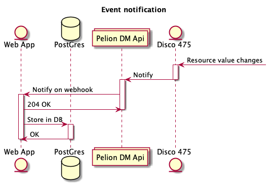

# Sample Pelion Web app
[](https://heroku.com/deploy)

A barebones Node.js app using [Express 4](http://expressjs.com/).

## Running Locally

Make sure you have [Node.js](http://nodejs.org/) and the [Heroku CLI](https://cli.heroku.com/) installed.

```sh
$ git clone https://github.com/ArmMbed/aiot-workshop-web-app.git # or clone your own fork
$ cd aiot-workshop-web-app
$ npm install
$ npm start
```

Your app should now be running on [localhost:5000](http://localhost:5000/).

## Deploying to Heroku

```
$ heroku create
$ git push heroku master
$ heroku open
```

or

[](https://heroku.com/deploy)

## App Architecture
This app consists of 
- barebones express.js web server
- react.js app
- postgres database
- [Pelion Device Management JavaScript SDK](//github.com/ARMmbed/mbed-cloud-sdk-javascript)


## App startup

At startup this app will initialise the db table and setup the webhook channel with Pelion Device management.  The app will start a request for subscriptions to device resources.


## Device resource changes

When the resource value on a device changes, the notification channel is updated with this information and the web app stores each notification in the postgres database



## Visualising Data

The included react app requests all data from the server and visualises this using the recharts library


