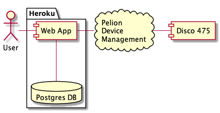

# Sample Pelion Web app

[Demo Deployment](https://mbed-workshop.herokuapp.com/)

[](https://heroku.com/deploy)

A barebones Node.js app using [Express 4](http://expressjs.com/).

## Required

- API Key from Pelion Device Management: `APIKEY`
- API Host of Pelion Device Management if not default: `APIHOST`

## Launch from Github

Create an app in Heroku by cloning from an existing Git repository

1. Goto Github app: [Workshop App on Github](https://github.com/bertfroeba/workshop-web-app)
2. Click Deploy to Heroku button [](https://heroku.com/deploy)
3. Create a free Heroku account
   - Provide First name, Last name, Email address, Role, Country, Development language
4. Confirm your email and set a password
5. Welcome -> Click here to proceed
   - Continues create app flow
   - Enter name for your app: `APP`

Build process starts and app will deploy

## Set Config Vars

Heroku apps provide configuration options through environment variables. These are called config vars. Two are required for this app to be setup

- Goto `Manage App` -> Find the `Settings` -> Select `Reveal Config Vars`

| Key                    | Value                                  | Optional | Default                             |
| ---------------------- | -------------------------------------- | -------- | ----------------------------------- |
| MBED_CLOUD_SDK_API_KEY | `APIKEY`                               |          |                                     |
| HOSTNAME               | https://`APP`.herokuapp.com/           |          |                                     |
| MBED_CLOUD_SDK_HOST    | `APIHOST`                              | ✓        | https://api.us-east-1.mbedcloud.com |
| DEVICE_ID              | Comma separated list of device IDs     | ✓        | \*                                  |
| RESOURCE               | Comma separated list of resource paths | ✓        | /3303/\*                            |

## Provision a Database

This app requires access to a Postgres database to store resource values. Heroku provides a free-tier access to hosted Postgres without requiring billing information

1. Navigate to Resources -> Add-ons
2. Search for `postgres` and attach a free hobby account

## Check for issues

The Heroku app deploys into `dynos` which are hosted containers running application code. The website provides access to the logs and output of the application

- Navigate to `More` and select `View logs`

## Check deployment

The app is also available at the website provided. Once the application is confirmed to be running in the logs and the config vars are set, it is time to view the app

- Click `Open App`

## Running Locally

Make sure you have [Node.js](http://nodejs.org/) and the [Heroku CLI](https://cli.heroku.com/) installed.

```sh
$ git clone https://github.com/ArmMbed/aiot-workshop-web-app.git # or clone your own fork
$ cd aiot-workshop-web-app
$ npm install
$ npm start
```

Your app should now be running on [localhost:5000](http://localhost:5000/).

## Deploying to Heroku

```
$ heroku create
$ git push heroku master
$ heroku open
```

or

[](https://heroku.com/deploy)

## App Architecture

This app consists of

- barebones express.js web server
- react.js app
- postgres database
- [Pelion Device Management JavaScript SDK](//github.com/ARMmbed/mbed-cloud-sdk-javascript)



## App startup

At startup this app will initialise the db table and setup the webhook channel with Pelion Device management. The app will start a request for subscriptions to device resources.


## Device resource changes

When the resource value on a device changes, the notification channel is updated with this information and the web app stores each notification in the postgres database


## Visualising Data

The included react app requests all data from the server and visualises this using the recharts library


